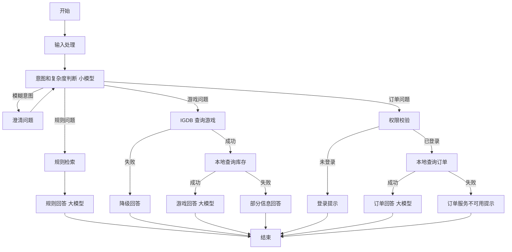

# rent-agent

LangGraph workflow-style skeleton for JoyRent.

## Current status
- ✅ Project structure scaffolded
- ✅ Configuration migrated from `rag_llm_engine`
- ✅ Dual-model architecture (intent + answer)
- ✅ Core workflow implemented (`state` / `graph` / `nodes` / `tools` / `api`)
- ⏳ Automated tests are still placeholders and need to be completed

## Quick Start

### 1. Install dependencies
```bash
pip install -e .
```

### 2. Configure environment (optional for demo)
```bash
# 如果需要真实运行，复制配置文件并填入 API Key
cp .env.example .env
# 然后编辑 .env 文件，填入真实的 DASHSCOPE_API_KEY 等
```

### 3. Verify configuration
```python
from rent_agent.config import config
print(f"Intent Model: {config.INTENT_MODEL}")
print(f"Answer Model: {config.ANSWER_MODEL}")
```

## Architecture

### Dual-Model Design (Cost Optimization)
```
用户输入 → 意图识别(tongyi-xiaomi-analysis-flash) → 路由分发 → 最终回答(qwen3.5-plus)
           ¥0.0008/1K              ↓           ¥0.004/1K
                              clarify/rule/game/order
```

### Cost Comparison
- **Single Model**: ~¥0.012/conversation (qwen3.5-plus only)
- **Dual Model**: ~¥0.005/conversation (60% savings)

## Next Steps
- [ ] Add real unit tests in `tests/test_graph.py` and `tests/test_nodes.py`
- [ ] Add integration tests for `/chat` and `/chat/debug` API paths
- [ ] Improve error handling and fallback responses for external tool failures
- [ ] Tune prompts and route thresholds based on real conversations

## 规划流程（文字版）
开始 -> 输入处理 -> 意图/复杂度判断（小模型）
路由=澄清 -> 澄清问题 -> 回到意图/复杂度判断
路由=规则 -> 规则检索 -> 规则回答（大模型） -> 结束
路由=游戏 -> IGDB 查询 -> 本地库存查询 -> 游戏回答（大模型） -> 结束
IGDB 查询失败 -> 降级回答 -> 结束
库存查询失败 -> 部分信息回答 -> 结束
路由=订单 -> 权限校验
已登录 -> 本地订单查询 -> 订单回答（大模型） -> 结束
订单查询失败 -> 订单服务不可用提示 -> 结束
未登录 -> 登录提示 -> 结束

## 规划流程（Mermaid）

